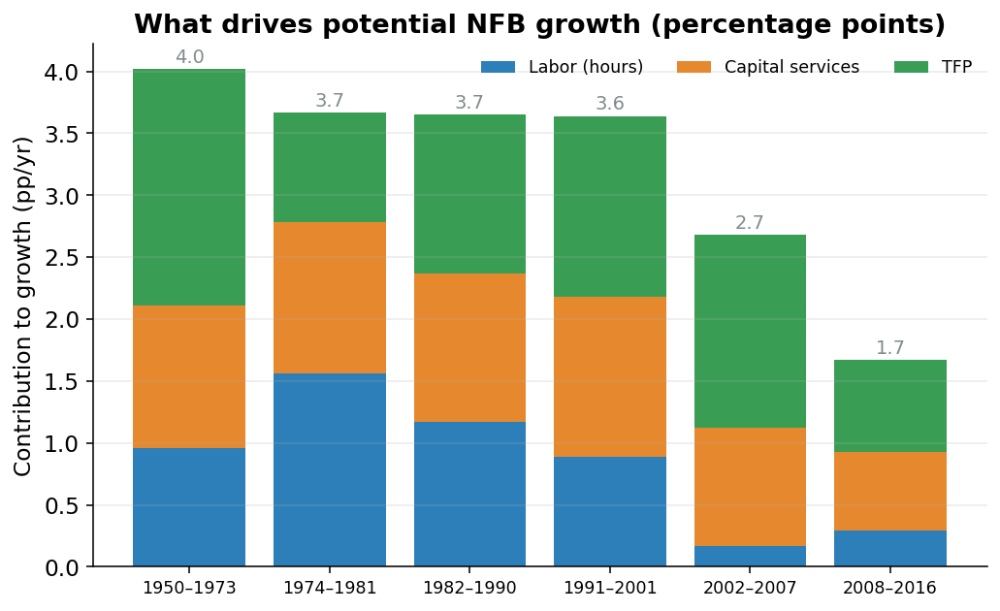

## From parts to a whole

The pieces are built: potential labor (how many hours people can sustainably work), potential capital services (how hard the machines and buildings are working), and potential TFP (the leftover know-how that lets the same workers and machines produce more over time). Each is its own number, sitting in its own file.

This page combines them into a single number: **potential GDP**, the dollar value of everything the economy *could* produce at full, sustainable use of its workers and machines.

## Nonfarm business first

The biggest chunk of the economy (about three-quarters of it) is the **nonfarm business** sector.^[Nonfarm business, or NFB, is every private company that isn't a farm: factories, stores, banks, software firms, restaurants.] This sector gets the full **Cobb-Douglas production function**. Plug in potential labor, potential capital, and potential TFP; out comes potential output for the sector.

::: {#nte-cobb-douglas .callout-note title="The production function"}
Potential nonfarm-business output is the technology level $A$ times capital $K$ and labor $L$, each raised to a power that reflects how big a role it plays:
$$
Y = A \, K^{\alpha} \, L^{1-\alpha}
$$
Here $\alpha$ (about $0.36$ in the U.S.) is capital's share of income, so $1-\alpha$ (about $0.64$) is labor's share. The two powers add up to one, which says: double *both* workers and machines, and you double output.
:::

In the code, the same equation is written in **logarithms**, which turn the multiplications and powers into plain additions.^[A logarithm answers "how many times do I multiply to get this number?" Working in logs turns "$A$ times $K^\alpha$ times $L^{1-\alpha}$" into "log A plus alpha times log K plus...": addition instead of multiplication. At the end, $e^x$ (`np.exp`) undoes the log and returns to dollars.] The actual lines, copied from `aggregation.py`:

```python
log_qgdpnfbfe = (
    kshare * np.log(icap_lag)
    + (1 - kshare) * np.log(ilabfe)
    + np.log(annual_potentials["iprodfe"])
    + gdpconst
)
qgdpnfbfe = np.exp(log_qgdpnfbfe).rename("qgdpnfbfe")
```

In plain English: take capital's share (`kshare`, that is $\alpha$) times log capital (`icap_lag`), add labor's share (`1 - kshare`) times log labor (`ilabfe`), add log TFP (`iprodfe`), add a constant that fixes the units, and undo the log. Out comes `qgdpnfbfe`, potential nonfarm-business output. The `fe` suffix is the model's tag for "full employment," its shorthand for *potential*.

## The other sectors take a simpler path

The rest of the economy (the other quarter) has four pieces: **farms**, **households** (which here mostly means the value of living in a home you own), **nonprofits**, and **government** (federal and state-and-local).

For most of these, potential output is potential hours times potential productivity.^[Productivity here means "output per hour of work." If a worker produces 50 dollars of stuff per hour and works a billion hours, that's 50 billion dollars of output.] No capital, no TFP, no powers.

Housing is the exception. You do not "work hours" to live in your own house. The house itself does the producing. For housing the model uses the *return on the housing stock*: the value the home throws off each year, scaled by how much housing there is. It is the one place in the model where capital, not labor, does the work.

## Aggregation: why you can't just add dollars

Each sector now has a number. **Aggregation** combines them into one economy-wide total.

You cannot simply add up "real" dollars across sectors. **Real** means inflation-adjusted: dollars stripped of price changes so you are measuring actual *stuff*, not bigger price tags. The trouble is that different sectors have wildly different price trends. Computers get cheaper every year; haircuts and houses get more expensive. A "2009 dollar" of computers and a "2009 dollar" of haircuts are not the same kind of dollar, and naively summing them gives a misleading total.

The official statisticians handle it with the **Fisher index**.

## The Fisher index: a fair average

To combine fast-growing computer output with slow-growing food output into one total, you weight them by price. But *which year's prices*?

Weight by **old prices** (computers were absurdly expensive back then), and computers dominate the weights: their fast growth gets *overstated*. Statisticians call this the **Laspeyres** way.

Weight by **new prices** (computers are cheap now), and computers barely count: their growth gets *understated*. That is the **Paasche** way.

Both are reasonable. Both are biased, in opposite directions. The Fisher index splits the difference by taking the **geometric mean** of the two.^[A geometric mean is an average for things that multiply: multiply the numbers and take the square root. For growth rates, it is the honest way to average.] One estimate leans high, the other leans low, and averaging cancels most of the bias: like asking two people who always over- and under-guess and meeting in the middle.

::: {#nte-fisher .callout-note title="The Fisher index"}
The Fisher growth rate is the geometric mean (the square root of the product) of the Laspeyres and Paasche growth rates:
$$
\text{Fisher} = \sqrt{\text{Laspeyres} \times \text{Paasche}}
$$
This is the exact method the **BEA** (the Bureau of Economic Analysis, the government agency that measures official GDP) uses to add up the national accounts. CBO uses it too, so its potential GDP is an apples-to-apples match with the BEA's actual GDP.
:::

In the code, the fair average is literally a square root. Verbatim from `fisher.py`:

```python
# ── Step 3: Fisher indices ──
# Fisher = geometric mean of Laspeyres and Paasche
fisher_q = np.sqrt(laspeyres_q_gross * paasche_q)
fisher_p = np.sqrt(laspeyres_p_gross * paasche_p)
```

## What the decomposition shows

@fig-contrib breaks potential nonfarm-business growth into its three inputs (labor, capital, and TFP) and shows how much each added in different eras. This picture ties the last three pages together.

{#fig-contrib width=88%}

Each bar is a stretch of history, and the colored segments stack up to that era's total potential growth. In the **Golden Age** (1950-1973) all three inputs were generous, and TFP alone (the pure "we got smarter" piece) contributed nearly 1.9 percentage points a year. Total potential growth was about 4% a year.

After 2007, *all three* segments shrink at once. Labor growth slows as the workforce ages, capital deepening cools off, and TFP growth drops to under 1 point a year. Stacked together, potential growth falls to roughly 1.65% a year, about two-fifths of the Golden Age pace. The slump isn't one bad input. It is a little less of everything.

## The final total

The last step is short. Take the nonfarm-business output and add the other sectors. The headline line in the code:

```python
gdpfe = (gdpnfbfe + gdpgfe + sectoral_potentials["gdpaffe"] + gdpsvhfe).rename("gdpfe")
```

That is potential GDP in *nominal* (current-price) dollars: nonfarm business plus government plus farms plus household-and-nonprofit. Adding nominal dollars is fine, because nominal dollars are all in the same year's prices already.

For the *real* (inflation-adjusted) total, the model uses the Fisher index instead of plain addition. That is the `fisher_aggregate_with_residual` call:

```python
qgdpfe, pgdpfe = fisher_aggregate_with_residual(
    nominal_all, real_all, price_all,
    residual=smoothed_residuals.get("qgdp_resfe"),
    sample_start=sample_start, sample_end=sample_end,
)
```

Note the `residual=...` argument. Because Fisher aggregation rebuilds the total from sub-pieces, the sum can land a hair away from the BEA's official definition of GDP. The model adds back a tiny, pre-smoothed correction (the **Fisher residual**) so the potential total lines up exactly with how the official statisticians draw the GDP boundary. A small correction that keeps the model consistent with the published numbers.

## What we have, and what's next

`qgdpfe`: one number for each year, real potential GDP in 2009 dollars, assembled from labor, capital, and TFP, combined the same way the BEA combines actual GDP.

Every number so far is *historical*: what the economy could have produced from 1949 to today. How the model says anything about the **future** is the next page.
