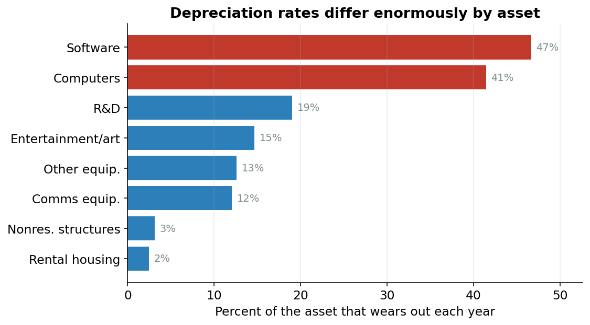
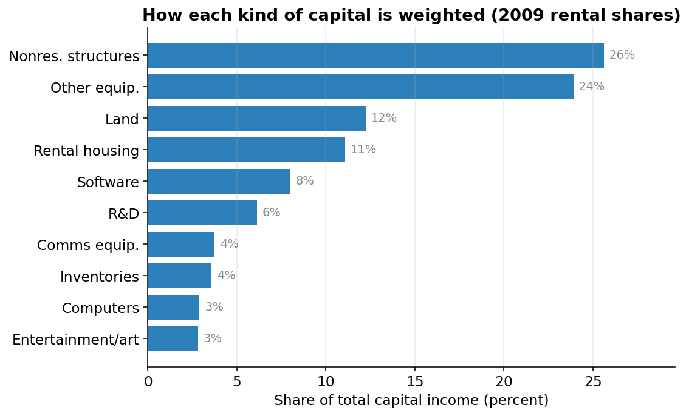

## The problem

People don't build cars with their bare hands. They build them with machines, factories, software, and tools. That input is **capital**, and it is what this page measures.

Measuring capital looks easy: add up the dollar value of everything a business owns. A million-dollar building plus a million-dollar pile of laptops is two million dollars of capital, right?

Wrong, and not by a little. A dollar tied up in laptops does a very different *amount of work* for you in a year than a dollar tied up in land. Two ideas that sound identical have to be separated first.

## What you own vs. what it does for you

::: {#nte-stock .callout-note title="Capital stock vs. capital services"}
**Capital stock** is the dollar value of everything a business owns: machines, buildings, software, land, inventory. It's a *sticker price*: what you'd pay to replace it all today.

**Capital services** is the *flow of useful work* that capital provides over a year: the actual productive help you get from those assets. This is what we want for production.
:::

Stock and services usually move together: more assets, more work done. But the *ratio* between them differs wildly across kinds of capital. That ratio is the whole story.

## The rent trick

Forget *owning* assets. Imagine you had to **rent** every one of them for a year, the way you might rent a tool from a hardware store instead of buying it.

How much rent would a thing cost? Mostly it depends on how fast it falls apart.

A laptop loses something like **40% of its value every single year**.^[That is a real number from this model's data: computer equipment depreciates at over 40% per year. A three-year-old laptop is nearly worthless.] Renting one out, you'd have to charge a *lot*: enough to cover the huge chunk of value it loses while the renter uses it, plus a normal profit. The yearly rent is a big fraction of the laptop's price.

Land is the opposite. Land doesn't wear out. Renting out an acre, you'd charge a small rent: a normal return on the money, with nothing extra for wearing out, because it doesn't.

This wearing-out has a name.

::: {#nte-dep .callout-note title="Depreciation"}
**Depreciation** is how much of an asset wears out, on average, in one year, written as the Greek letter delta, $\delta$. A laptop has a high $\delta$ (it dies fast); a building has a low one; land's is essentially zero.
:::

@fig-dep shows how far apart these rates are. Short-lived gear and long-lived structures are in completely different worlds.

{#fig-dep width=85%}

If you just *add up dollars*, you treat a dollar of laptops and a dollar of land as the same thing. But a dollar of laptops does far more work each year. That is exactly why it commands a high rent. Adding dollars **understates** the fast-wearing gear (computers, equipment) and **overstates** the long-lived stuff (land, structures).

The fix: weight each asset by its **yearly rent**, not its sticker price.

## Putting a number on the rent

These rents are never observed: businesses own their assets, they don't rent them from a catalog. The model has to *compute* what the rent would be. That implied yearly cost has a name.

::: {#nte-rental .callout-note title="Rental price"}
The **rental price** of an asset is the implied cost of using one unit of it for a year. In words, it's:

$$
\text{rental price} \;\propto\; (\rho + \delta - \pi) \times \tau \times K_{-1}
$$

- $\rho$ (rho) is the **rate of return**: the normal yearly profit any dollar should earn, the same number for every asset.
- $\delta$ (delta) is **depreciation**: the wear-and-tear from @nte-dep. High for laptops, near zero for land.
- $\pi$ (pi) is the **expected price change**: if the asset is getting cheaper over time (computers!), that's a small extra cost of holding it. The model uses a 5-year average so one weird year doesn't swing it.
- $\tau$ (tau) is a **tax adjustment**: taxes and tax breaks mean a dollar of rent doesn't translate one-for-one into income, so we scale it.
- $K_{-1}$ is the asset's stock at the *start* of the year: how much of it you had to begin with.
:::

The intuition to hold onto: **rent goes up when an asset wears out fast or is losing value.** That is why a dollar of computers carries far more rent than a dollar of land.

The rate of return $\rho$ is solved so that all ten rents, added up, exactly equal the total income that capital earned in the economy that year.^[This is the Jorgenson-Hall identity, after the two economists who worked it out in 1967. It's a consistency check: the rents have to add up to the money capital actually earned.] Land's share is set last, as whatever's left over, so everything balances to the penny.

## Adding things up: an index

Each asset now has a rent. Combining ten kinds of capital, growing at ten different speeds, into a single measure of capital services takes an **index**.

::: {#nte-index .callout-note title="Index"}
An **index** is a number that tracks how something *changes over time*, set to a convenient baseline. Here the baseline is the year **2009 = 1.0**. An index value of 1.13 means "13% more than in 2009," and 0.50 means "half of the 2009 level." The dollar units wash out; only the growth matters.
:::

The specific formula is the **Törnqvist index** (named after a Finnish economist). It is a weighted average:

> Take each asset's **growth rate** this year, multiply it by that asset's **share of the total rental bill**, and add them all up.

A fast-growing asset only moves the total a lot if it is also a big share of the rent. Computers grew enormously over the decades, but they are a small piece of the overall rental bill, so they nudge the index rather than dominate it. The heavy weights are structures (factories, offices) and equipment.

@fig-shares shows these weights (each asset's **rental share**) for the year 2009. Structures and equipment carry big shares. Computers, despite all their growth, are a thin sliver of the total bill.

{#fig-shares width=85%}

The model tracks **ten asset types**: three kinds of equipment (computers, communications gear, other), three kinds of intellectual property (software, R&D, and entertainment/literary/artistic originals), nonresidential structures, rented residential housing, land, and inventories.

## The code, line by line

The heart of it, from `capital_services.py`:

```python
rentprop = factor_shares["rentprop"]
sharebar = frac_shares.rolling(2).mean()

# Build log-growth rates per asset
log_growth = {}
for asset in EQUIPMENT + IPP + ["str", "lnd", "inv"]:
    q = _qkni(asset, df)
    log_growth[asset] = np.log(q / q.shift(1))
# Tenant-occupied: log-growth of rentprop · qknifixr
tor_quantity = rentprop * df["qknifixr"]
log_growth["tor"] = np.log(tor_quantity / tor_quantity.shift(1))

log_growth_df = pd.DataFrame(log_growth)
delta_log_kbar = (sharebar * log_growth_df).sum(axis=1)

# Chain: start temp_chain at 1 in 1948 (EViews lines 968-972) and
# cumulate exp(Δlog K̄) thereafter.
temp_chain = pd.Series(np.nan, index=df.index)
if 1948 in temp_chain.index:
    temp_chain.loc[1948] = 1.0
years = sorted([y for y in df.index if y >= 1949])
prev = 1948
for year in years:
    temp_chain.loc[year] = temp_chain.loc[prev] * np.exp(delta_log_kbar.loc[year])
    prev = year

icap = temp_chain / temp_chain.loc[base_year]
```

Step by step:

1. **`sharebar`** is each asset's rental share, averaged over *two years* (this year and last). The two-year average is a small technical fix that makes the index mathematically exact. `frac_shares.rolling(2).mean()` does exactly that.

2. **`log_growth`** is each asset's growth rate: how much more (or less) of that asset there was this year than last.^[The *log* of the growth ratio makes growth rates add up cleanly. Reading it as "the percent change" loses nothing here.]

3. **`delta_log_kbar = (sharebar * log_growth_df).sum(axis=1)`** is the Törnqvist idea in one line: multiply each asset's growth by its rental-share weight, then add across all the assets. That is the year's total capital-services growth.

4. The **chaining loop** links these yearly growth rates into one continuous series, starting at 1.0 in 1948 and multiplying outward.

5. The last line, **`icap = temp_chain / temp_chain.loc[base_year]`**, re-centers everything so that **2009 = 1.0**.

The result is a single series, `icap`. In 1948 it sits at about **0.12**: the economy's capital base did roughly an eighth of the work it would do in 2009. By 2016 it reaches about **1.13**, or 13% above the 2009 level. Over the whole stretch, capital services grew about **3.4% per year**.

## Next

Labor and capital are now measured. They do not explain all of output. Year after year, the economy produces *more* than labor and capital together can account for: the same workers and the same machines make more than they used to. That leftover is **productivity**, measured next.
