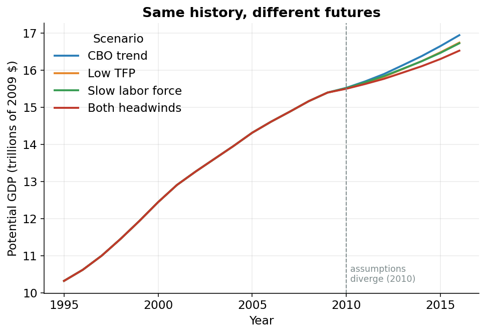

## The forecast was hiding in plain sight

Everything so far is *history*: what the economy could have produced from 1949 up through the most recent data.

Where does the *forecast* come from? There is no separate forecasting model. The smooth trend lines fitted through the bumpy historical data get extended past the edge of the data. That is the forecast.

::: {#nte-extrapolation .callout-note title="Extrapolation"}
**Extrapolation** means continuing a pattern past the data you actually have. The forecast in this model is exactly that: the historical trend lines, extended forward.
:::

When CBO "forecasts" potential TFP or potential employment for years where the data is thin or missing, it is trusting the slope it already measured and walking it forward. The trend that *smooths* history is the same trend that *predicts* the future.

## The fork we added: trust CBO, or speak for yourself

What if you don't believe CBO's extended trend? Maybe you think American productivity will stay sluggish, or that an aging population will drag down how fast the workforce grows. The published model gives you no way to say so.

We added one. It is a fork in a road. For each of two key series, TFP (the productivity leftover) and employment (how many people are working), you reach a boundary year and choose a path:[The default boundary is the first quarter of 2010, written `2010Q1` in the code. Everything before it is real historical estimation and never changes.]{.column-margin}

- **`"cbo"`**: keep going straight. Trust CBO's extended trend exactly as before.
- **`"user"`**: take the off-ramp. Splice in *your own* assumed future trend instead (for example, "assume TFP grows only 0.5% per year from here on").

The two forks are set independently. You can second-guess productivity while trusting CBO on jobs, or the other way around.

::: {#nte-splice .callout-note title="Splice"}
A **splice** joins your assumed future onto the real historical estimate at the boundary year: CBO's estimate is kept up to the boundary, and your path is attached from the boundary onward, anchored to the *last real value* so the line never jumps. The history before the seam stays byte-for-byte identical to CBO's.
:::

## Growing your assumption, one quarter at a time

Tell the model "assume TFP grows 0.5% per year from 2010 on." The code grabs the last real value just before the boundary (the *anchor*) and grows it forward, quarter by quarter, at your rate. The data is quarterly, so a yearly rate is converted to the equivalent quarterly step first (one year is four quarters, so the quarterly step is the fourth root of the annual growth).[Turning 0.5% per year into a quarterly step: `(1 + 0.5/100) ** 0.25 - 1`. Compounding that four times gets back to 0.5% over the full year.]{.column-margin}

The heart of it, copied from `forecast.py`. The loop walks across the projection window, and each quarter is the previous quarter grown by your rate:

```python
def splice_growth(cbo_series, growth_annual_pct, boundary):
    boundary_p, window = _projection_window(cbo_series.index, boundary)
    anchor = boundary_p - 1
    if anchor not in cbo_series.index:
        raise ValueError(
            f"Cannot splice: anchor quarter {anchor} (just before "
            f"FORECAST_START={boundary}) is not in the series."
        )

    g = growth_annual_pct.reindex(window).ffill().bfill()

    out = cbo_series.copy()
    prev = anchor
    for q in window:
        q_growth = (1 + g.loc[q] / 100) ** 0.25 - 1
        out.loc[q] = out.loc[prev] * (1 + q_growth)
        prev = q
    return out
```

Start at the `anchor` (the last real value). For each quarter `q` in the window, take the previous quarter `out.loc[prev]`, multiply by `(1 + q_growth)`, and store the result. This quarter becomes the `prev` for the next. Anchoring to the last real value means the spliced path starts exactly where history left off. No jump at the seam.

## The default is untouched

The override only runs if you ask for it. For TFP, that decision is one small function in `tfp.py`:

```python
def project_potential_tfp(iprodfe_cbo, forecast_mode, user_trend_file,
                          forecast_start):
    if forecast_mode == "cbo":
        return iprodfe_cbo
    if forecast_mode == "user":
        return apply_user_forecast(
            iprodfe_cbo, user_trend_file, forecast_start
        ).rename("iprodfe")
    raise ValueError(
        f"TFP_FORECAST_MODE must be 'cbo' or 'user', got {forecast_mode!r}"
    )
```

The first two lines of the body: in `"cbo"` mode the function hands back `iprodfe_cbo`, the trend path, untouched, and *returns immediately*. The splicing code never runs. That is why the default model reproduces CBO's published numbers exactly.

## Same history, four different futures

@fig-scen overlays four runs of the full model, fed different assumptions.[The four shipped scenarios: `cbo` (trust both trends), `lowtfp` (0.5%/yr TFP), `lowemp` (0.3%/yr employment), and `lowboth` (both headwinds at once).]{.column-margin}

Through 2009, all four lines sit *exactly on top of each other*, because before the boundary every scenario is the identical CBO history. At 2010, they fan out.

One path assumes weaker productivity. Another assumes a slower-growing labor force. A third assumes *both* headwinds at once. Each pessimistic assumption bends the future lower, and together they pull average potential-GDP growth over 2010-2016 from about **1.5% per year** (the CBO trend) down toward about **1.1% per year** in the gloomiest scenario.

1.5% versus 1.1% sounds tiny. It is the difference between an economy that doubles in size every 47 years and one that takes about 63. Compounded over a working lifetime, that is a noticeably poorer country.

{#fig-scen width=85%}

## Try your own assumption

You don't have to take our scenarios. The model reads a small CSV: a date column and **exactly one** value column:

- a **`quarter`** column, like `2010Q1` (a bare year like `2012` is automatically expanded to all four of its quarters), and
- *either* a **`growth_annual_pct`** column (your assumed yearly growth rate, in percent) *or* a **`level`** column (the actual value you want to pin), but never both.

Quarters you leave out inherit the last value you gave, so a single row sets a flat assumption for the entire future. The shipped TFP example is two lines:

```
quarter,growth_annual_pct
2010Q1,0.5
```

That row says: *from 2010 on, assume potential productivity grows 0.5% per year*, below CBO's extended trend. Change the `0.5`, rerun, and the model rebuilds the whole future around your number.

The point: the model answers "what if" questions about America's growth. *What if the productivity slowdown is permanent? What if an aging country keeps the labor force flat?* Change one number and watch potential GDP respond.

None of this matters unless the model actually reproduces what it claims to. That check, against CBO's own published numbers, cell by cell, is the last page.
