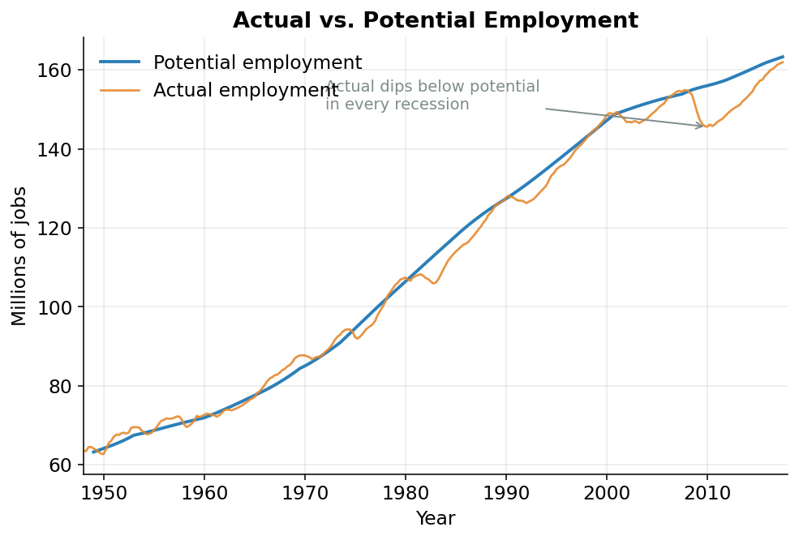

## Where we are

Last page, we met the engine: a recipe that turns *workers* and *machines* into *output*. We said the engine has two main ingredients, labor and capital, plus a quality knob called productivity. This page is about the first ingredient (labor) and about one idea that turns out to matter for the whole rest of the model.

Here is the idea. We do not want to measure how much work the economy is *actually* doing right now. We want to measure how much work it would be doing if things were *normal*, not in the middle of a boom, not in the middle of a slump. That "if things were normal" version is what we'll call **potential**. Getting from the actual, wiggly numbers to the smooth potential version is the real job of this page.

## What "labor" even means here

Start simple. The amount of labor going into the economy is just:

$$
\text{labor} = (\text{number of people working}) \times (\text{hours each one works})
$$

That's it. Ten people working 40 hours a week is the same amount of labor as twenty people working 20 hours. So to measure labor we need two things: a *headcount* (how many people have jobs) and an *hours count* (how long they're each on the clock). The code handles these in two stages (employment first, then hours) and this page follows that order.

Before we count, two terms you'll need.

The **labor force** is everyone who either has a job or is actively looking for one.^[Someone who has retired, or who isn't looking for work at all, is *not* in the labor force. The labor force is the pool of people available to work.]

The **natural rate of unemployment** is the slice of that labor force that is unemployed even when the economy is humming along fine. It is never zero. At any moment some people are between jobs: they just moved, they just graduated, they're switching careers. That churn is normal and healthy, and it means a perfectly healthy economy still has, say, four or five people out of every hundred looking for work.

::: {#nte-natural .callout-note title="Natural rate of unemployment"}
The normal, baseline level of unemployment that exists even in good times: from people changing jobs, entering the workforce, or relocating. It is the unemployment rate you'd expect when the economy is neither overheating nor in a slump.
:::

## "Potential" means: ignore the wiggle

Now the key move.

Think about a thermostat. The temperature in your room is never exactly 70 degrees. It drifts a degree up when the heater kicks off, a degree down before it kicks back on. If someone asked you "how warm is this room?", you wouldn't recite every tiny fluctuation. You'd say "about 70." That "about 70" is the *setting* (the level the room is built to hold) and the little up-and-down drift is just the system breathing.

The economy works the same way. In a **boom** (a stretch when business is unusually strong), firms hire aggressively and more people work than the economy can sustain for long. In a **recession** (a stretch when business is unusually weak), firms cut back and fewer people work than normal. Employment is always drifting above or below its sustainable setting.

That up-and-down drift around the economy's normal level has a name: the **business cycle**.

::: {#nte-cycle .callout-note title="Business cycle"}
The economy's repeated swings above and below its long-run trend: booms when it runs hot, recessions when it runs cold. The cycle is the temporary wiggle; the trend is the underlying level the economy keeps returning to.
:::

"Potential employment" is the thermostat setting, not the temperature. It's the headcount you'd see if the economy were running at a normal pace: no boom inflating it, no recession deflating it. And the distance between the actual headcount and that potential setting has a name too: the **employment gap**. When the gap is positive, more people are working than is sustainable (we're hot); when it's negative, fewer are working than normal (we're cold).

## Building the gap from the labor force

So how does the code pin down "potential"? It starts at the top, with the whole labor force.

If the labor force has a certain number of people, and the natural rate says some normal fraction of them will be unemployed at any time, then the number who'd be working in normal times is just the rest. Multiply the labor force by *one minus* the natural rate, and you get potential employment as counted by the **household survey**, one of the two ways the government counts jobs.^[The government actually counts jobs *two* ways. The **household survey** phones households and asks who has a job. It counts *people*. The **establishment survey** asks businesses how many positions they're filling. It counts *jobs*. The two disagree, partly because some people hold more than one job. The model estimates each on its own and then reconciles them; for the main story you only need the household count below.]

Here is exactly that calculation, copied from `build_base_series` in `employment.py`:

```python
ehhcfe = (1 - q["rucfe"] / 100) * q["lcfe"]
empgap = (q["ehhc"] / ehhcfe - 1) * 100
e_dif = q["etotal"] - q["ehhc"]
re_dif = e_dif / q["ehhc"]
```

Read the first two lines in plain English.

Line one builds potential employment, named `ehhcfe`. `lcfe` is the labor force; `rucfe` is the natural rate of unemployment in percent. So `(1 - rucfe/100)` is "the fraction of the labor force that works in normal times," and multiplying it by the labor force gives the normal, sustainable headcount.

Line two builds the **employment gap**, named `empgap`. `ehhc` is the *actual* household headcount. The ratio `ehhc / ehhcfe` asks "how does today's actual headcount compare to the normal one?", and subtracting 1 and multiplying by 100 turns that into a percentage. If `empgap` is `+1.5`, actual employment is one and a half percent *above* its sustainable level: the economy is running hot. If it's `-3`, employment is three percent below normal: we're deep in a slump.

That single number, `empgap`, is the economy's thermometer. It shows up again and again, because it's the signal the model uses to detect *which way* the cycle is pushing.

## Smoothing the wiggle: the regression idea

We now know how hot or cold the economy is at every moment. The remaining task is to take a bumpy, real-world employment series and recover the smooth potential path hiding underneath it. This is the first place in the model where we do that, and the same trick gets reused everywhere afterward, so it's worth slowing down.

The tool is a **regression**. A regression is just a disciplined way of drawing a line through scattered data. Imagine plotting a cloud of points and asking a computer, "draw me the single straight line that comes closest to all of them." That line summarizes the trend and ignores the scatter. A regression does exactly that, except it can lean on several explanations at once, not just time.

Here's how the model uses it. For each employment series, the regression is told to explain the bumpy data using two *kinds* of ingredients:

- **The cyclical signals**: the employment gap `empgap` and its quarter-to-quarter change. These capture the wiggle: how much of today's number is just the boom or the slump talking.
- **A set of piecewise time trends.** A **time trend** is simply a steady drift as the years pass: picture a straight line sloping gently upward across the decades. *Piecewise* means the model doesn't force one single slope across all of history; it allows a different straight-line slope for each era (the 1950s, the 1970s, the years after 2001, and so on), because the workforce grew at genuinely different rates in different decades. Think of it as connecting several straight segments end to end instead of bending one rigid ruler across seventy years.

The regression figures out how much weight each ingredient deserves. And here's the payoff: once it knows the recipe, it can **keep the trend part and throw away the cyclical part**. The trend part is the smooth, sustainable path. That's potential. The cyclical part is the wiggle we wanted gone.

The everyday version of this: it's like ignoring whether today happens to be unusually hot or rainy so you can see the *climate*: the underlying pattern of the seasons. Or like taking a wobbly line you drew freehand and tracing the clean curve you *meant* to draw. You're not inventing anything; you're removing the noise.

## Subtracting the cycle, line by line

The function that does the throwing-away is named `strip_cycle`. Here it is, verbatim from `employment.py`:

```python
def strip_cycle(y_hat, X, results):
    """
    Subtract the cyclical contributions (empgap, Δempgap, dummy_census)
    from a fitted series to recover the "potential" or trend component.

    EViews syntax:
        series y_fe = y_hat - (empgap * @coefs(2))
                            - (Δempgap * @coefs(3))
                            - (dummy_census * @coefs(4))

    @coefs(2..4) are the second, third, fourth coefficients: the three
    cyclical regressors in the order they appear in the equation.
    """
    return (
        y_hat
        - X["empgap"]       * results.params["empgap"]
        - X["delta_empgap"] * results.params["delta_empgap"]
        - X["dummy_census"] * results.params["dummy_census"]
    )
```

Don't let the symbols scare you. The logic is one sentence. `y_hat` is the regression's full prediction, trend *and* wiggle baked together. Each line below it pulls one cyclical piece back out.

Take `X["empgap"] * results.params["empgap"]`. The regression learned how strongly the cycle pushes employment around: that learned strength is the *coefficient* (`results.params["empgap"]`). Multiply that strength by how hot or cold the economy actually was (`X["empgap"]`), and you get "the part of today's employment that was purely the boom or slump talking." Subtract it, and that contribution is gone. The function does the same for the *change* in the gap (`delta_empgap`) and for a one-off bump that has nothing to do with the cycle.^[`dummy_census` is a tiny on/off switch that flips to 1 only in the handful of quarters when the government hired a wave of temporary Census workers (1970, 1980, 1990, 2000, 2010). That hiring spike isn't part of the real trend, so the model treats it as one more thing to strip out, right alongside the cyclical terms.]

What's left after all the subtracting? The trend. The smooth, cycle-free path. That leftover *is* potential employment. Every "potential" series in this entire model (employment, hours, productivity, all of it) is built by this same two-step move: fit a line that explains both trend and cycle, then subtract the cycle back off.

You can see the result in @fig-emp. The bumpy line is actual employment; the smooth line riding through the middle of it is potential. Notice how actual employment sags *below* potential in every recession and climbs *above* it in every boom: exactly the breathing-around-a-setting picture we started with.

{#fig-emp width=85%}

## And then, hours

Headcount is only half of labor. We still need to know how long each person works.

The model handles hours with the *exact same* recipe (fit a trend-plus-cycle line, then strip the cycle) just applied to a different quantity: **average weekly hours**, meaning the typical number of hours one worker puts in per week. To get that, the code takes each sector's total hours and divides by the number of workers in it.

```python
weekly[f"mhe{s}"] = (q[f"mh{s}"] / q[f"e{s}"]) * 1000 / 52
```

Here's the careful version. `mh` is total hours worked over a year, measured in *billions* of hours; `e` is the number of workers, measured in *millions*. So dividing one by the other doesn't quite give plain hours per worker: because billions divided by millions leaves a factor of a thousand, the raw ratio comes out in *thousands* of hours per worker per year. That's what the two final numbers fix. The `1000` turns those thousands back into actual hours per worker per year, and the `52` then spreads that yearly figure across the 52 weeks of the year to give hours per worker per *week*. Once you have weekly hours, the same cycle-stripping logic recovers *potential* weekly hours: what a normal work-week would look like, with the overtime of a boom and the cutbacks of a slump removed.^[One small exception: military reservists are paid for fixed training periods set by law, so their hours barely move with the economy. There's no cycle to strip, so the model just uses their actual hours.]

Multiply potential headcount by potential weekly hours, and you have **potential labor**: the smooth, normal-times amount of work the economy supplies. That's the first ingredient of the engine, fully built.

## Up next

Labor is one ingredient; capital is the other. But capital comes with a twist. When you add up the machines, buildings, and computers a business uses, a dollar's worth of one is *not* the same as a dollar's worth of another: a delivery truck and a desktop computer earn their keep very differently. On the next page we'll see why the model weighs each kind of capital by what it would cost to *rent* it, so that a dollar isn't just a dollar.