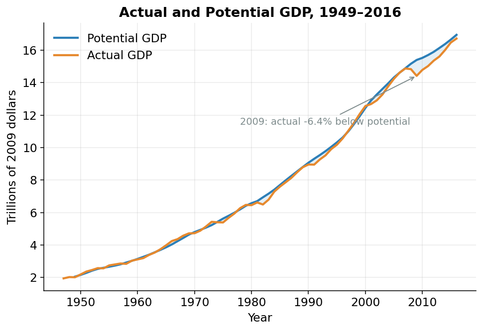
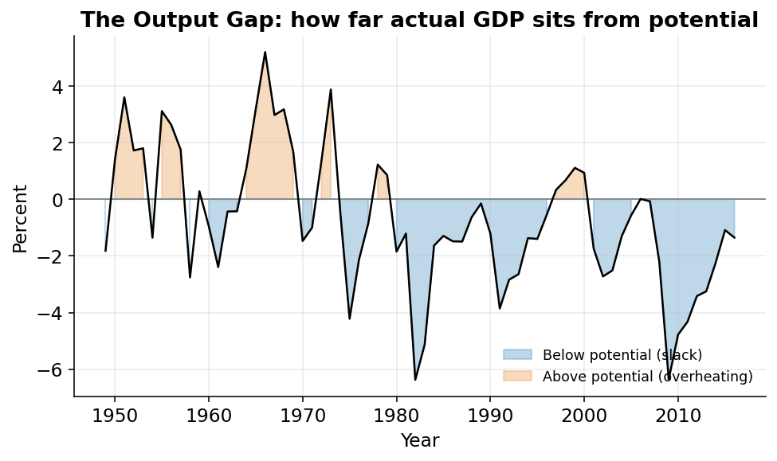

## The economy has a speedometer

Your car can hit 120 miles per hour. *Could* you drive that fast the whole trip? For a while. But the engine would scream, you would burn through gas, and something would break. There is a different speed, your comfortable cruising speed, that you can hold for hours. Fast, but sustainable.

An economy works the same way. It can produce *more* than usual for a stretch by working everyone overtime and running every factory flat out. But it also has a cruising speed: the level of output it can sustain without overheating. This page measures both speeds and the difference between them.

That difference is the number this whole model exists to produce.

## What GDP measures

**GDP** stands for *Gross Domestic Product*: the dollar value of everything an economy produces in a year. Every haircut, every loaf of bread, every phone, every doctor's visit, added up into one number.^[For the U.S. that number is in the tens of trillions of dollars. The exact figure matters less than how it *moves* over time.] List every good and service the country produced, multiply each by its price, and the total is GDP.

There is a trap. Suppose next year the country produces the *exact same* loaves of bread, but bread costs twice as much. Dollar-value GDP doubles, and not one extra loaf was baked. That is inflation, not production.

The fix is **real GDP**: GDP adjusted so we count *stuff*, not price changes. Freeze prices at one year's level and ask how much was actually produced. When real GDP rises, the economy genuinely made more.

::: {#nte-real-gdp .callout-note title="Real GDP"}
**Real GDP** is the total quantity of goods and services an economy produces in a year, measured in the prices of a single fixed *base year* so that price changes don't muddy the picture. When real GDP rises, the country is truly producing more.

Throughout this project the base year is **2009**, so real GDP is reported in "2009 dollars."
:::

## Potential GDP: the cruising speed, not the top speed

**Potential GDP** is *not* the maximum the economy can produce. It is the sustainable level, the cruising speed. It answers a hypothetical: how much *would* the economy produce if its workers and factories were used at normal, non-inflationary rates?

"Non-inflationary" is the key word. You *can* push an economy past its potential: hire every available worker, run the machines around the clock, pay overtime. Output rises. But like flooring the car, you can't hold it there. Prices rise, the labor market gets frantic, and the strain shows up as inflation. Potential GDP is the fast-but-sustainable pace.

[Two things drive potential output: how many people are working at normal rates, and how much they each produce. The rest of this section unpacks both.]{.column-margin}

The crucial difference from real GDP: *real* GDP is observable. We measure what the economy did. *Potential* GDP can never be observed, because it is a "what if." Nobody runs the economy twice, once normally and once flat-out, to compare. It has to be *estimated* from a model. Building that estimate, the way the Congressional Budget Office builds it, is what the rest of these pages do.

## The output gap: how far above or below cruising speed

The distance between actual real GDP and potential GDP is the **output gap**: the percentage difference between what the economy produced and what it could sustainably produce.

$$
\text{output gap} = \left(\frac{\text{actual GDP}}{\text{potential GDP}} - 1\right) \times 100
$$

Read it as a speedometer reading relative to your cruising speed:

- A **negative** gap: actual is *below* potential. The economy is coasting under its comfortable speed. This is **slack**: idle factories, workers who want jobs but can't find them. A recession.
- A **positive** gap: actual is *above* potential. The economy is flooring it, and inflation pressure builds.
- A gap near **zero**: the economy is at its cruising speed.

@fig-gap shows both pieces. Actual and potential GDP track each other closely most of the time. In recessions, the actual line dips below potential and a shaded gap opens up. That shaded area *is* the slack: production the economy could have managed but didn't.

{#fig-gap width=85%}

## Why the CBO cares

The output gap tells policymakers how much room they have to act.

The **Congressional Budget Office (CBO)** is the nonpartisan agency that crunches numbers for the U.S. Congress. Its potential-GDP estimates feed the federal budget projections Congress relies on, and they inform the **Federal Reserve**, the central bank that sets interest rates.^[The Federal Reserve, or "the Fed," adjusts interest rates to keep inflation and unemployment in check.]

In a downturn, the gap measures slack: how much more the economy could safely produce. If the gap is large and negative, there is room to stimulate (lower interest rates, government spending) *without* triggering inflation, because stimulus just brings output back up to cruising speed. If the gap is near zero, the same stimulus overheats the economy.

## The deepest gap

The worst moment in the data is the trough of the **2009 recession**, the bottom of the financial crisis.

Actual GDP sat about **6.4% below potential**, the deepest gap in the sample. In plain terms: the economy produced roughly 6 cents less of every dollar's worth of output it could have sustained. Across a multi-trillion-dollar economy, that is an enormous amount of lost production: factories quiet, millions of workers without jobs they wanted. That number is why the policy response was so aggressive. There was huge room to stimulate before any risk of overheating.

@fig-gap2 plots the gap over time. The line wiggles near zero, dips in each recession, and hits its lowest point, that −6.4%, at the 2009 trough.

{#fig-gap2 width=85%}

## One line of code

In `scenarios.py`, once the model has computed both series, the output gap is one line:

```python
# Output gap = how far actual GDP sits below potential, in percent.
df["output_gap_pct"] = (df["qgdp"] / df["qgdpfe"] - 1) * 100
```

`qgdp` is **actual real GDP**. `qgdpfe` is **potential real GDP**, the cruising-speed estimate (the `fe` stands for "full employment").^[Any series ending in `fe` is the *potential* version of that series. The suffix appears all over the code.] The line divides one by the other, subtracts 1, and multiplies by 100. That is the formula above, and the same arithmetic the figures are drawn from.

## What's next

Computing the gap requires `qgdpfe`, potential GDP, which cannot be read off any chart. The rest of these pages build it. The starting point is the rule for how workers, machines, and know-how combine into output: the **production function**.
