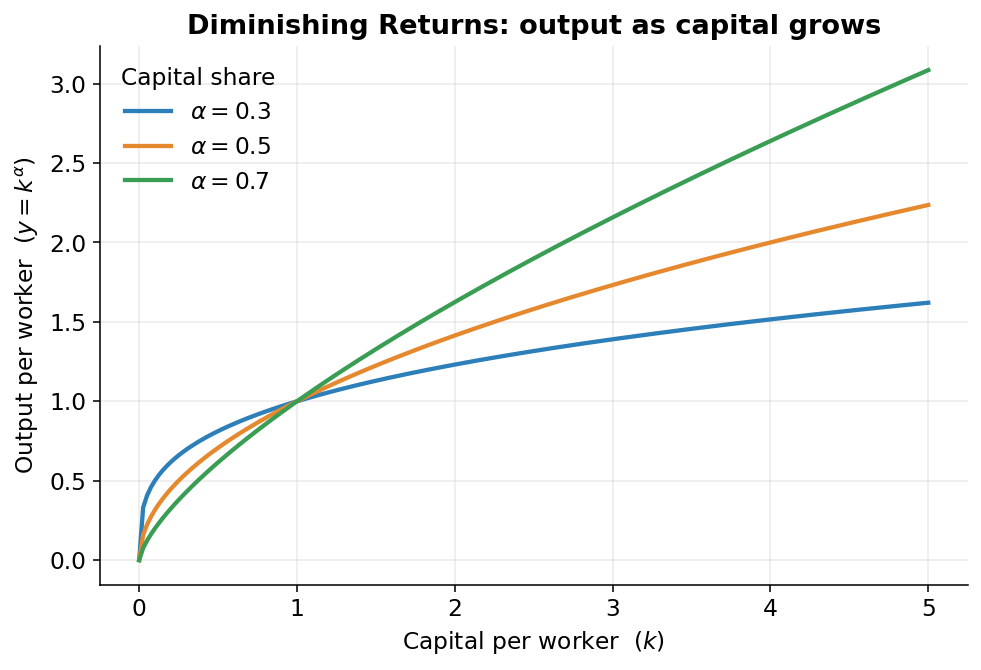

## Building the missing number

The output gap compares actual output to what the economy could have produced. That second number can't be looked up anywhere. Nobody publishes it.

The model has to build it. Building it requires a rule that turns the economy's inputs into output. Economists call that rule a **production function**: a recipe that says, "give me this much of each ingredient, and I'll tell you how much you can make."

## Output is a dish; the ingredients are labor, capital, and know-how

Think about baking bread.

The loaf that comes out of the oven is your **output**. To get it, you needed three kinds of ingredient:

- **Labor**: the hours of work people put in. The baker kneading, measuring, watching the oven. In the economy, this is the total hours that workers put in.
- **Capital**: the *tools and equipment* you bake with: the oven, the mixer, the pans, the kitchen itself. In the economy, capital means machines, factories, office buildings, trucks, computers, and software.^[Capital is anything durable that helps you produce but isn't "used up" in one go. A loaf of bread is output; the oven that baked it is capital.]
- **Know-how**: how good your recipe is. Two bakers with the exact same oven, the same flour, and the same hours can get very different loaves if one has a better technique. Economists call this **total factor productivity**, shortened to **TFP**: how cleverly you combine everything else.

More of any ingredient raises output. So does a better recipe. More workers, more ovens, or a smarter technique: any of them lifts how much you make.

The specific recipe this model uses is the **Cobb-Douglas production function**, the most-used production function in economics. It captures that "more inputs or better know-how means more output" idea in one line.

## The recipe, written down

Every symbol is translated below.

::: {#nte-prod .callout-note title="The Cobb-Douglas production function"}
Output is capital and labor, each raised to a power, scaled up by productivity:
$$
Y = A \cdot K^{\alpha} \cdot L^{1-\alpha}
$$
where $Y$ is output, $K$ is capital, $L$ is labor, $A$ is total factor productivity (the recipe quality), and $\alpha$ is **capital's share of income**, about $0.36$ in U.S. nonfarm business.
:::

Reading it left to right:

- $Y$ is **output**, the dish. Here, the output of the *nonfarm business sector*: the part of the economy that isn't farms or the government, roughly three-quarters of all U.S. production.^[The model treats the economy as six sectors. Only nonfarm business gets the full Cobb-Douglas recipe; the smaller sectors use simpler rules covered later.]
- $A$ is **total factor productivity**, the recipe quality. A bigger $A$ means more output from the same workers and machines.
- $K$ is **capital**, and $L$ is **labor**, the two physical ingredients.
- $\alpha$ (the Greek letter "alpha") needs its own section.

## Alpha: how income splits between workers and capital

When a business sells what it produces, the money splits. Some pays the *workers*: wages and salaries. The rest goes to the *owners of the machines and buildings*, the people who put up the capital. That second share is **capital's share of income**. That is what $\alpha$ measures.

In U.S. nonfarm business, $\alpha$ is about $0.36$. Out of every dollar the sector earns, roughly 36 cents flows to the owners of capital, and the other 64 cents flows to workers as pay.

That is why the exponents add up the way they do. Capital is raised to the power $\alpha$ (0.36), and labor is raised to $1 - \alpha$ (0.64). The two exponents are the two shares of the same income, so they add to 1.

Why exponents instead of plain multiplication? Exponents make each ingredient matter in proportion to its share. Workers earn the bigger share, so labor moves output more than capital does, dollar for dollar. The $0.64$ exponent builds that in.

## More machines help, but less and less each time

Give one office worker a second computer monitor. They can keep email open on one screen and work on the other. Real productivity boost. A third monitor helps less. A fourth is marginal. By the tenth, they're decorating the cubicle. Each additional monitor adds *something*, but less than the one before.

This is **diminishing returns**: piling on more of one ingredient (here, capital per worker) keeps raising output, but by smaller and smaller amounts. @fig-cd shows the shape: output climbs as you add capital per worker, and the curve flattens as it rises.

{#fig-cd width=80%}

The curve bends but never turns downward: more capital is never *bad*, it just helps less and less. The value of $\alpha$ controls how sharply it bends: a bigger capital share means capital pulls more weight, so the curve rises higher before it flattens.

## Double everything, and you double output

Because the two exponents add to exactly 1, the recipe has **constant returns to scale**: double *every* ingredient at once (twice the workers, twice the machines, same know-how) and you get exactly twice the output.

That is the difference between adding capital *per worker* (diminishing returns, the flattening curve) and scaling the *whole operation* up evenly (constant returns, output doubles). Build a second identical bakery next door, fully staffed and equipped, and you bake twice as much bread.

## The three ingredients, and what "potential" means

The recipe needs three numbers, each measured on its own page:

- **Labor**: total worker hours (page 4).
- **Capital services**: how much productive work the machines and buildings provide (page 5).
- **TFP**: the recipe quality, the leftover know-how (page 6).

The point is not to build *actual* output. We already have that. The point is **potential** output, so the model feeds the recipe the *potential* version of each ingredient: potential hours (what people would work at full employment), potential capital, and potential TFP (the underlying trend, with temporary booms and busts smoothed out).

## The recipe, as the code runs it

The exact block from `aggregation.py` that computes potential nonfarm-business output:

```python
kshare = annual["kshare"]
log_qgdpnfbfe = (
    kshare * np.log(icap_lag)
    + (1 - kshare) * np.log(ilabfe)
    + np.log(annual_potentials["iprodfe"])
    + gdpconst
)
qgdpnfbfe = np.exp(log_qgdpnfbfe).rename("qgdpnfbfe")
```

It looks different from the formula in @nte-prod, but it is the same recipe written in **logarithms**.

A **logarithm** (or "log") has one property that matters here: it turns multiplication into addition. The log of "$a$ times $b$" equals "log of $a$" plus "log of $b$." A recipe written as a chain of *multiplications* becomes a chain of *additions*, which is faster and steadier for a computer.

The formula $Y = A \cdot K^{\alpha} \cdot L^{1-\alpha}$ maps to the code line by line:

- `kshare` is $\alpha$, capital's share (0.36).
- `icap_lag` is the capital $K$: last year's capital services, since this year's production runs on machines that were already in place.^[The capital is "lagged" by one year: you produce in 2016 using the factories and equipment that existed at the end of 2015.]
- `ilabfe` is potential labor $L$, the potential worker-hours.
- `iprodfe` is potential TFP $A$, the potential recipe quality.
- `gdpconst` is a fixed constant that pins down the units, so the index lands on the right scale (2009 dollars).

The first line, `kshare * np.log(icap_lag)`, is the log of $K^{\alpha}$. The second, `(1 - kshare) * np.log(ilabfe)`, is the log of $L^{1-\alpha}$. The third, `np.log(...iprodfe)`, is the log of $A$. The code *adds* them because in logs, adding is what multiplying becomes. `np.exp(...)` reverses the logarithm and hands back the plain output number, `qgdpnfbfe`: potential nonfarm-business output.

The code is $Y = A \cdot K^{\alpha} \cdot L^{1-\alpha}$, fed the *potential* version of each ingredient, run through logs for the computer's convenience.

## Next

Each input has to be measured at its potential level. Labor first.
