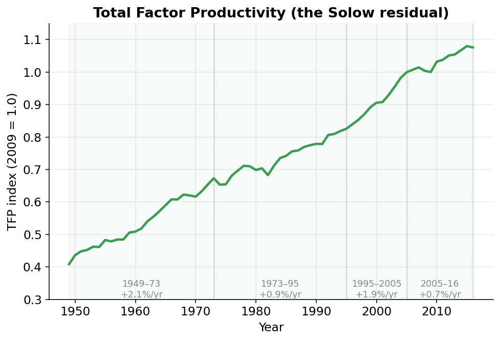

## Where does the extra growth come from?

Count the workers and their hours. Build an index of the machines, buildings, and equipment they work with. Add more of either and the economy can make more. That part is obvious.

But add up how much output you'd expect from all those workers and machines, and the economy keeps producing *more than that*. Year after year, there is a surplus the inputs can't explain.

Think of two cooks in the same kitchen with the same ingredients. One turns out a flat, gray dinner; the other turns out something you'd pay for. Nothing on the counter is different. What's different is the *recipe*: the know-how, the technique, the way everything is put together.

Economists call that leftover ingredient **total factor productivity**, or **TFP**.^[The word "factor" is economist-speak for an input: labor and capital are the two "factors of production." *Total factor* productivity means productivity of *all* the inputs taken together, not just labor.] It's better technology, smarter organization, sharper management: everything that lets the same workers and the same machines produce more than they did before.

## We never see it directly. We back it out

TFP can't be measured. No government survey calls up factories and asks how much "know-how" they have this quarter.

So we measure everything we *can* (output, capital, labor) and ask: how much of the output is left *unexplained* once the workers and the machines are credited? That leftover is our estimate of TFP. Because it is what's *left over* after the accounting, it has a famous name: the **Solow residual**.^[Named after Robert Solow, who won a Nobel Prize partly for showing in the 1950s that most of US growth came from this residual, not from piling up more machines. "Residual" means leftover.]

::: {#nte-solow .callout-note title="TFP and the Solow residual"}
The production function says output $Y$ comes from capital $K$, labor $L$, and a productivity level $A$:

$$
Y = A \cdot K^{\alpha} \, L^{1-\alpha}
$$

Here $\alpha$ (alpha) is capital's share: the slice of income that goes to the owners of machines and buildings, about 0.36 in the US. Since we *know* $Y$, $K$, $L$, and $\alpha$, rearrange to solve for the one thing we don't know, $A$:

$$
A = \frac{Y}{K^{\alpha} \, L^{1-\alpha}}
$$

That $A$ **is** total factor productivity. The bottom of the fraction is "the output the inputs explain." Dividing actual output by it leaves the part nothing else accounts for: the **Solow residual**. We never observe TFP; we *back it out*.
:::

## Doing it in code

The calculation lives in `tfp.py`, in a function called `compute_annual_tfp`. The two lines that matter are @nte-solow written in Python.

```python
log_inputs = kshare * np.log(icap_lag) + (1 - kshare) * np.log(ilab)
ioutput = sample["qgdpnfb"] / np.exp(log_inputs)
iprod_annual = (ioutput / ioutput.loc[base_year]).rename("iprod_annual")
```

The first line builds the bottom of the fraction: the part inputs explain.^[$e^{\alpha \log K + (1-\alpha)\log L}$ is a tidy way of writing $K^{\alpha}L^{1-\alpha}$. Logs turn the multiply-and-power into an add, which computers handle more gracefully.] `kshare` is $\alpha$; `icap_lag` is the capital index from the previous page, lagged one year^[Why last year's capital? The factories and machines you work with this year are the ones that were already standing on January 1, built and bought in years gone by. Year *t*'s output is produced with the stock in place at the end of year *t-1*.]; `ilab` is the labor input: total hours worked, scaled so 2009 equals 1.

The second line does the division from the callout: actual nonfarm-business output (`qgdpnfb`) divided by the part the inputs explain. What's left, `ioutput`, is raw TFP.

The third line is bookkeeping. Raw TFP comes out in awkward units, so every year is divided by its 2009 value. That **normalizes** the series to an index where **2009 = 1.0**.^[An "index" is a series rescaled to equal 1 (or 100) in a chosen base year, so you read everything as a ratio to that year. The level is meaningless on its own; only the *changes* matter.] A value of 1.20 means "20% more productive than in 2009," and 0.80 means "20% less." That annual index is called `iprod_annual`.^[Once it's been spread out to quarters (below), the quarterly version is called `iprod`.]

## What the leftover did

With TFP measured year by year, you can watch the recipe of the American economy get better, stall, recover, and stall again. @fig-tfp is one of the most important charts in growth economics.

{#fig-tfp width=85%}

Left to right, four distinct chapters:

- **1949-1973, the "Golden Age."** TFP grew about **2.1% a year**, blistering by historical standards. The recipe was improving fast: postwar technology, the interstate highways, mass electrification finishing its work. Nearly half of all growth in this era came from the leftover, not from more machines or workers.
- **After 1973, the great slowdown.** Growth fell to roughly **0.9% a year** and stayed there for two decades. Economists still argue about why: oil shocks, the shift to services, the exhaustion of earlier breakthroughs. It's called the "productivity puzzle" because no single culprit fully explains it.
- **The late-1990s IT rebound.** Computers and the internet showed up in the numbers, and TFP growth jumped back to about **1.9% a year**.
- **The recent slowdown.** Since the mid-2000s, growth has sagged to roughly **0.7% a year**, weaker even than the 1970s slump. Whether this is permanent is one of the biggest open questions in economics.

These four numbers aren't trivia. The difference between 2% and 0.7% TFP growth, compounded over a working lifetime, is the difference between a country where your children are dramatically richer than you and one where they're barely better off.

## From a yearly number to a smooth potential trend

Two wrinkles.

The TFP just computed is **annual**: one number per year. The rest of the model runs on **quarters** (four data points per year). The code spreads each annual figure across its four quarters using an interpolation method called **Denton-Cholette**.^[Interpolation means filling in the in-between points. Denton-Cholette does it with one rule: the four quarters must average back to the true annual number, so nothing is invented. It borrows the *shape* of the quarter-to-quarter wiggles from a closely related series that is observed quarterly.] The quarters are guaranteed to average back to the year.

The second wrinkle is the same move used for labor. The raw TFP line is bumpy. It dips in recessions and spikes in booms, because in a downturn firms hang onto workers they aren't fully using. For *potential* GDP we want the underlying trend, not the business-cycle noise. The code regresses TFP on cyclical controls plus a set of trend pieces, then strips the cyclical part back out, leaving a smooth **potential TFP** path called `iprodfe`.

## All three inputs, in potential form

Potential labor, potential capital, and potential TFP are now built, each a smooth trend with the business cycle scrubbed out. The next page feeds all three into the production function and combines the sectors into a single number: **potential GDP**.
