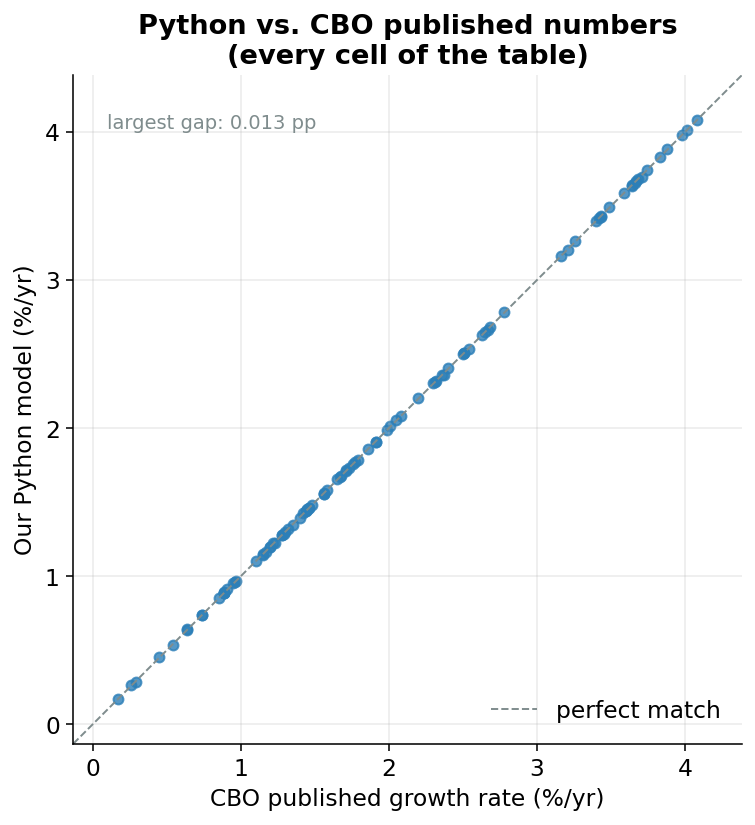

## Why we have to prove ourselves

In the last page you got to play forecaster, nudging future productivity and employment up or down and watching potential GDP respond. That only matters if the machine doing the responding is actually built right. So this final page is about trust.

Here's the situation. The Congressional Budget Office (the nonpartisan agency that estimates how much the U.S. economy *could* produce) wrote its real model in a specialized statistics language called EViews.^[EViews is a commercial program built for economists working with time series. It is powerful, but it is not something most people have on their laptop, and you cannot easily read or run it for free.] Everything you have seen on this site is a *rewrite* of that model into Python, line by line.

Whenever you translate something (a recipe from grandma's handwriting, a book from French to English, a model from one language to another) you can introduce mistakes. A misread number. A step in the wrong order. So before we ask you to believe anything this model says, we owe you a demonstration that the translation is faithful.

## Replication: cooking the dish and tasting it against the original

The trick is simple, and it is the same trick scientists use everywhere.

::: {#nte-replication .callout-note title="Replication (verification)"}
**Replication** means reproducing a result that is *already known to be correct* using your own method. If your method spits out the known answer, you have strong evidence your method is sound. If it doesn't, you have a bug to find.
:::

Think of it like a recipe. Suppose a famous chef publishes a photo of their finished cake along with the ingredient list. You follow the ingredient list in your own kitchen. If your cake comes out looking exactly like the photo, you can be pretty confident you followed the recipe correctly. If it comes out flat and purple, something went wrong.

We need a "photo of the finished cake" to compare against: a set of trusted numbers we did not produce ourselves.

::: {#nte-benchmark .callout-note title="Benchmark"}
A **benchmark** is the trusted reference you measure yourself against. Here, the benchmark is the **CBO's own published table of historical growth rates**: numbers the CBO printed in the documentation that ships with their official program. They are the answer key.
:::

So the benchmark is the CBO's answer key. The replication is running our Python and checking our answers, cell by cell, against it.

## What the answer key looks like

The CBO's table describes how fast the economy's *potential* grew during different chapters of American history. Each **row** is a different thing being measured: potential output itself, the potential labor force, potential hours worked, capital services, total factor productivity (the "leftover" efficiency term from earlier pages), and so on. Each **column** is a stretch of history: the postwar boom of 1950-1973, the slowdown of the 1970s, the 1990s tech boom, and so on, all the way to a final column for the whole 1950-2016 span.

Put together, that's 14 rows across 7 columns, exactly **98 numbers** in total. Our job is to land on all 98.

Here are three of those rows. The values are growth rates in percent per year. Read "3.98" as "grew about 3.98% every year, on average, during that period", which, compounded over a couple of decades, roughly *doubles* the size of that piece of the economy.

| Row (percent per year) | 1950-1973 | 1974-1981 | 1982-1990 | 1991-2001 | 2008-2016 |
|---|---|---|---|---|---|
| Potential Output | 3.98 | 3.16 | 3.42 | 3.26 | 1.45 |
| Potential Labor Force | 1.58 | 2.51 | 1.68 | 1.23 | 0.54 |
| Potential TFP | 1.91 | 0.89 | 1.28 | 1.46 | 0.74 |

Every one of those numbers is *both* what our Python computed *and* what the CBO published. They are the same to two decimals. [You can read the economic story in these rows: potential output growth fades from a brisk ~4% in the golden age to under 1.5% in the slow recovery after 2008.]{.column-margin}

## How the check works in code

Inside the model, one file does nothing but build that table and hold it up against the CBO's answer key. The answer key is stored literally in the code: a Python dictionary called `TARGET`, where each entry is one row of the CBO's published numbers:

```python
# CBO README values, used only for diagnostic comparison.
TARGET = {
    "Potential Output":        [3.98, 3.16, 3.42, 3.26, 2.40, 1.45, 3.21],
    "Potential Labor Force":   [1.58, 2.51, 1.68, 1.23, 0.97, 0.54, 1.45],
    "Potential LF Productivity":[2.37, 0.64, 1.71, 2.01, 1.42, 0.91, 1.73],
    ...
}
```

Then a short function lines up *our* number next to *their* number for every cell and subtracts one from the other. The subtraction is the whole point: a difference of zero means a perfect match.

```python
def compare_to_target(table):
    columns = list(table.columns)
    rows = []
    for name, target in TARGET.items():
        if name not in table.index:
            continue
        model = table.loc[name].values
        diff = model - np.array(target)
        ...
```

In plain English: for each row name, grab the model's row of values, grab the CBO's row of values, and compute `diff = model − target`. That `diff` is the gap between us and the answer key for every cell. If the model is faithful, every `diff` should be essentially zero.

## The verdict

It is. Across all 98 cells:

- The **worst** single cell is off by **0.013 percentage points**.
- The **average** miss is **0.003 percentage points**.

To feel how small that is: a growth rate of 3.21% versus 3.20% is a difference of 0.01, about the size of our *worst* error. On a $20-trillion economy, the typical gap between our number and the CBO's is far thinner than the rounding you would do by hand. For all practical purposes, the two models are identical.

@fig-ver shows this in one picture. Each dot is one cell of the table. The horizontal position is the CBO's published value; the vertical position is our Python value. The diagonal line is the line of *perfect agreement*. Any dot landing on it means "our number equals theirs exactly." Every single dot sits on the line.

{#fig-ver width=70%}

## Why it isn't *perfectly* zero

Honesty matters here, so let's be clear about that 0.013. We did not hit the answer key dead-on in every cell, and we should not expect to.

Two harmless things create those hairline gaps. First, **rounding**: the CBO published its table rounded to two decimals, and rounding always loses a sliver of precision. Second, and more interesting, EViews and Python don't always do the exact same arithmetic deep inside certain steps, especially the **smoothing filter**, a tool the model uses to draw a smooth trend line through bumpy data.^[A smoothing filter is like running your finger along a jagged mountain range to trace the overall ridgeline. It ignores the little jagged peaks to find the underlying shape. Two programs can trace slightly different ridgelines from the same mountains.] Different software can trace a very slightly different smooth line, and that tiny difference ripples forward into the final growth rates.

That is the entire source of the discrepancy. There is no hidden disagreement about *how the economy works*: only the kind of microscopic numerical dust you get any time two different programs grind through the same long calculation. "Matches" here honestly means *agrees to three-thousandths of a percentage point on average*, not *bit-for-bit identical*, and that is exactly the right standard for a faithful translation.

## The end of the tour

That closes the loop. We started this whole tour with a deceptively simple question (*how much could the U.S. economy produce if it were running at full health?*) and we answered it by building an engine: a production function fed by labor, by capital weighted to its rental cost, and by the leftover efficiency term we called TFP, all aggregated up into a single number for potential GDP, with a forecast that you yourself can steer.

And now you know it isn't a black box you have to take on faith. It reproduces the CBO's own published answer key to within a rounding error, cell by cell across seventy years of history.

So go back to the forecast page and break it. Push productivity down, imagine an older, slower-growing workforce, and watch the economy's ceiling bend. Every number it gives you is computed by the same verified machine you just watched pass its final exam.